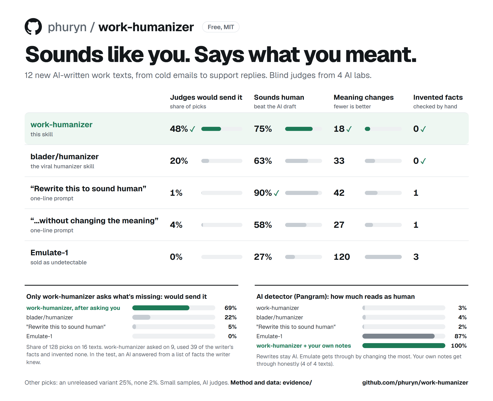

# work-humanizer

A humanizer for work writing. It takes the AI tone out of your text without changing what it says or commits to.

Sales emails, marketing copy, support replies, HR notes, legal letters: at work, the exact words are commitments. Ask an AI to make them sound human and it changes them on the way. It apologizes where you only acknowledged, attaches a condition to an offer, blames the customer. work-humanizer rewrites in a plain human voice and is built to keep every fact, commitment and caveat at the same strength. When a draft is missing what only you know, it asks you a few questions first.

An Agent Skill: works in any agent that loads `SKILL.md`, including Claude Code, Codex and Cursor.



## What the test found

12 new AI-written texts, rewritten by each tool on the same model, judged blind by four AI models from different companies, with every meaning change checked against the original.

- **Judges would send work-humanizer's version most often.** Shown what the writer meant and asked which rewrite they'd send, they picked work-humanizer 48% of the time and [blader/humanizer](https://github.com/blader/humanizer), the most popular humanizer skill, 20%. A one-line "rewrite this to sound human" prompt got 1%.
- **It changes the least.** 18 meaning changes across the 12 texts, against 33 for blader/humanizer, 42 for the one-line prompt and 120 for Emulate-1. work-humanizer invented no facts in any of the 56 texts it rewrote across five test sets.
- **The one-line prompt reads more human, and that's the catch.** It beat the AI draft on 90% of judgments to work-humanizer's 75% because it rewrites freely: it changes more and adds things the writer never said. Judges who could see the original sent it once in 96 picks.
- **No rewrite gets past an AI detector.** On Pangram, work-humanizer, blader/humanizer and the one-line prompt all leave the text reading as AI (2 to 4% human). Emulate-1, sold as undetectable, reaches 87% by changing the most.
- **Your own reasoning does.** Given the writer's own notes, work-humanizer's version scored 100% human on Pangram on 4 of 4 texts. It builds the piece on the writer's reasoning (their claims, in their order, with their own because and so) and rewrites sentences where they need it. Word choice matters least: in an earlier test, an AI rephrase of a human article still read 99–100% human.
- **Only work-humanizer asks you for what's missing.** When a draft lacks facts only the writer knows, the other tools rewrite around the gap, and some make things up. work-humanizer asks a few questions and uses your answers: on 16 texts it asked on 9, used 39 of the writer's facts and invented none, and judges would send its version 69% of the time (blader/humanizer 22%). In the test, an AI answered for each writer from a list of facts they knew; with real people it is untested.

## What each tool fixed, and what it changed


## Install

Copy the `skills/work-humanizer` folder into your agent's skills folder:

| Agent | Folder |
|---|---|
| Claude Code | `~/.claude/skills/work-humanizer` (all projects) or `.claude/skills/work-humanizer` (one project) |
| Codex | `~/.codex/skills/work-humanizer` |
| Other agents | the agent's skills folder; work-humanizer is a standard `SKILL.md` plus two supporting files |

Or with the [Skills CLI](https://skills.sh): `npx skills add phuryn/work-humanizer`.

## Use

```text
Use work-humanizer on this: <paste text>
Use work-humanizer on this and interview me first: <paste draft>
Use work-humanizer on docs/launch-post.md
```

**For the most human result, give it your own material.** Paste your notes, a voice-memo transcript or a rough draft you wrote yourself. work-humanizer builds the piece on your argument, in your order, and keeps your sentences where it can. If you also have an AI draft, it only uses it as a checklist of points.

`skills/work-humanizer/check.py` is an optional mechanical sweep (dashes, semicolons, stock AI vocabulary, filler transitions, pause-and-point lines, sentence-length band). Agents that can run code use it as the last check; you can run it yourself: `python skills/work-humanizer/check.py draft.md`.

## What it does

**Rewrite mode** (default). It lists every fact with its level of certainty, then writes the piece fresh in the writer's voice (contractions, the speaker talking as themselves, everyday verbs) instead of patching the AI sentences. It keeps every claim at the same strength, fixes the tells strongest first, and ends with a sentence-by-sentence fact audit. The tells: contrasts nobody claimed ("it's not X, it's Y"), pause-and-point lines, restating closers, stacked aphorisms, sentences that do the reader's thinking, inflation and generic claims, hedges in the wrong place, uniform sentence lengths, labels that say nothing, dashes rerouted into semicolons, decoration, chat residue. It refuses to fake it: no planted typos, no bolted-on slang, no invented anecdotes.

**Interview mode.** Some drafts fail a simple test: could anyone with the same one-line request have written this? No edit fixes that, because what's missing is the real example, the number, what went wrong, what the writer actually thinks. work-humanizer asks up to five questions that are cheap to answer, phrased to get you talking ("the way you'd say it out loud"), then builds the piece from your answers.

**Your notes.** When you give it notes or a transcript, those are the main material. Your claims, the order you make them in and your examples become the skeleton, and it asks only about what they leave open. When it's justified, it also offers a much shorter option, up to about half the length, and lists what it would cut. It never cuts on its own: the decision is yours.

## How it was tested

Every tool ran on the same model (Claude Sonnet) in a fresh session with the same wrapper; only the skill text differed. Judges: Grok, DeepSeek, Qwen and OpenAI Codex, with Claude Opus reported separately. Each judge saw the candidates without labels, in two random orders, and answered two separate questions: which reads more like a skilled human wrote it (original hidden among the candidates), and which one they would send (original shown as "what the writer meant"). A fact checker listed every dropped, changed and added item, and every invented fact was checked by hand. Pangram 4, a commercial AI detector, scored the outputs.

The published version was frozen before the 12 scoreboard texts were generated. One more arm in that run, a variant we tested and did not adopt, took 25% of the send picks. The Pangram numbers for rewrites come from the 16 main test texts (13 of them for work-humanizer, before the account ran out of credits), where the AI drafts started at 4% human.

Caveats: small samples (12 texts on the scoreboard, 56 across all sets, 4 for the notes result); the texts were sales, marketing, support, product and internal writing, with no contracts or other legal documents; AI judges rather than people, and the judges disagree on what "human" means; one sample per text per tool; one Pangram version on one day; a simulated writer in interview mode; and the people who built the skill designed the test. Full method, data, judge verdicts, fact checks and scripts: [`evidence/`](evidence/README.md). Read it before quoting any number.

## Repository

```
skills/work-humanizer/        the skill: SKILL.md, tells.md (word lists), check.py (mechanical sweep)
examples/             short before-and-after examples from the test
evidence/             method, results, raw data, judge verdicts, fact checks, scripts to reproduce
tests/                unit tests for check.py
```

## Credits

- [blader/humanizer](https://github.com/blader/humanizer) (MIT), tested at commit `225a6f39ac85f76ee48dbad772ea4abe4ed6c9d8` (v3.1.0). Its text is not included here; `evidence/scripts/fetch_blader.py` downloads it at that commit to reproduce the comparison. Several of the tells both skills catch trace back to Wikipedia's [Signs of AI writing](https://en.wikipedia.org/wiki/Wikipedia:Signs_of_AI_writing), which blader/humanizer is built on.
- Emulate-1 ([tryemulate.ai](https://www.tryemulate.ai)) and [Pangram](https://www.pangram.com) were used through their public APIs at their published prices.

## License

MIT. See [LICENSE](LICENSE).
